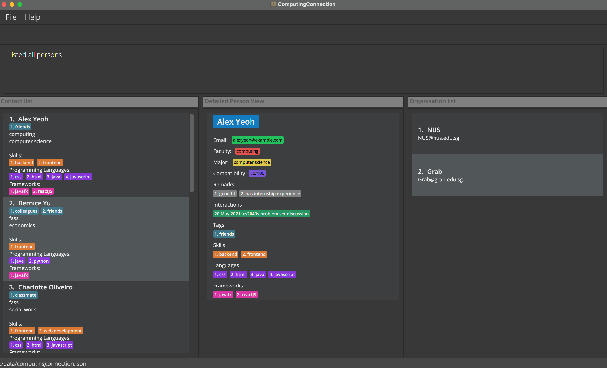
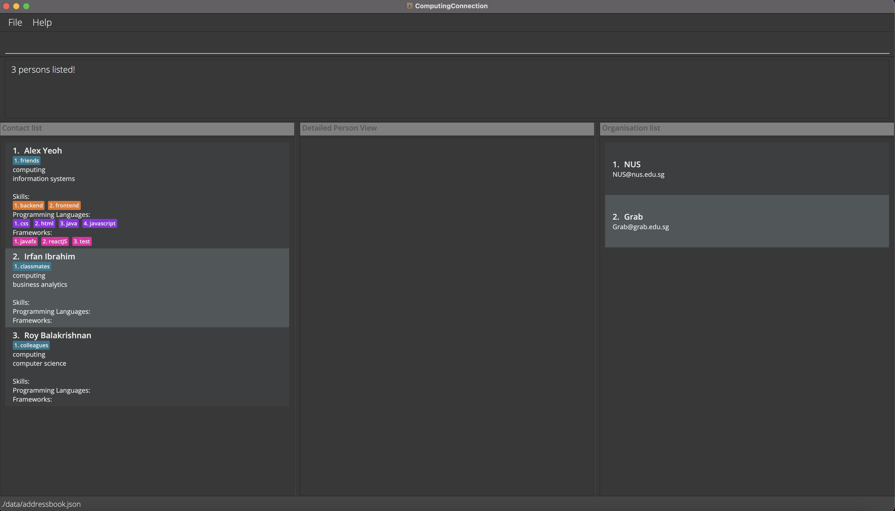

ComputingConnection is for entrepreneurial students in NUS Computing who want to keep track of other students’ skill sets so that they can easily look for suitable people to work with on future projects. The users should prefer to use the Command Line Interface (CLI) over a Graphical User Interface (GUI) for efficiency with a keyboard.

Through an address book, this product aims to store information such as faculty, major, programming languages, interests, past projects, remarks of peers that the user has encountered throughout university. ComputingConnection will help the student remember and document his/her network of students encountered in NUS for easy reference in the future.

* Table of Contents
{:toc}

--------------------------------------------------------------------------------------------------------------------

## Quick start

1. Ensure you have Java `11` or above installed in your Computer.

1. Download the latest `computingconnection.jar` from [here](https://github.com/AY2122S1-CS2103T-W10-3/tp/releases).

1. Copy the file to the folder you want to use as the _home folder_ for your ComputingConnection.

1. Double-click the file to start the app. The GUI similar to the below should appear in a few seconds. Note how the app contains some sample data. 
   

1. Type the command in the command box and press Enter to execute it. e.g. typing **`help`** and pressing Enter will open the help window. 
   Some example commands you can try:

   * **`list`** : Lists all contacts.

   * **`add`**`n/John Doe e/johnd@example.com f/computing m/computer science` : Adds a contact named `John Doe` to the address book, with the respective email, faculty and major fields.

   * **`delete`**`3` : Deletes the 3rd contact shown in the current list.

   * **`clear`** : Deletes all contacts.

   * **`exit`** : Exits the app.

1. Refer to the [Features](#features) below for details of each command.

--------------------------------------------------------------------------------------------------------------------

## Features

### Data fields of a Person: 
Personal data fields
* n/: name
* e/: email

University data fields
* f/: faculty
* m/: major

Skill data fields
* s/: skill
* l/: programming language
* fr/: framework

Miscellaneous data fields
* t/: tags
* r/: remarks

### Viewing help: `help`
Shows a message explaining how to access the help page.
Format: `help`

### Adding a Person to ComputingConnection: `add`
Adds a Person to the address book.

Format: `add n/NAME e/EMAIL f/FACULTY m/MAJOR [s/SKILL] [l/PROGRAMMING LANGUAGE] [fr/FRAMEWORK] [t/TAG]...`

* A Person must have one and only one name, email, faculty and major.  
* A Person may have any number of skills, languages, frameworks and tags (including 0).

Examples:
* `add n/John Doe e/johnd@nus.edu.sg f/computing m/computer science`
* `add n/Seth e/seth@nus.edu.sg f/computing m/computer science s/frontend l/javascript t/friend`

### List view of contacts : `list`

Shows a list of all contacts in the address book.

Format: `list`

### Sort contacts : `sort`

Sorts contacts and shows the list of contacts in alphabetical order.

Format: `sort`

### Editing a contact : `edit`

Edits an existing contact in the address book.

Format: `edit INDEX [n/NAME] [p/PHONE] [e/EMAIL] [r/ROLE] [f/FACULTY] [m/MAJOR] [a/ADDRESS] [t/TAG]…​`

* Edits the contact at the specified `INDEX`. The index refers to the index number shown in the displayed contact list. The index **must be a positive integer** 1, 2, 3, …​
* At least one of the optional fields must be provided.
* Existing values will be updated to the input values.
* When editing tags, the existing tags of the contact will be removed i.e adding of tags is not cumulative.
* You can remove all the contact’s tags by typing `t/` without
    specifying any tags after it.
  
### Appending multiple data fields: `append`
Appends a new element to data fields that support multiple elements.

Format: `append 1 [s/SKILL] [l/PROGRAMMING LANGUAGE] [fr/FRAMEWORK] [t/TAG]...`

* The index refers to the index number shown in the displayed contact list.
* The index **must be a positive integer** 1, 2, 3, …​

Examples:
* `append 3 s/webdev l/python t/classmate` Appends 'webdev' to the skill data field, 'python' to the language data field, and 'classmate' to the tag data field of the Person at index 3 in the list. 

### Detailed View of Contacts : view
Get a detailed view of specific contact(s).
Format: `view n/NAME`
Examples:

*  `edit 1 p/91234567 e/johndoe@example.com` Edits the phone number and email address of the 1st contact to be `91234567` and `johndoe@example.com` respectively.
*  `edit 2 n/Betsy Crower t/` Edits the name of the 2nd contact to be `Betsy Crower` and clears all existing tags.

### Locating contacts by name: `find`

Finds contacts whose names contain any of the given keywords.

Format: `find KEYWORD [MORE_KEYWORDS]`

* The search is case-insensitive. e.g `hans` will match `Hans`
* The order of the keywords does not matter. e.g. `Hans Bo` will match `Bo Hans`
* Only the name is searched.
* Only full words will be matched e.g. `Han` will not match `Hans`
* Contacts matching at least one keyword will be returned (i.e. `OR` search).
  e.g. `Hans Bo` will return `Hans Gruber`, `Bo Yang`

Examples:
* `find John` returns `john` and `John Doe`
* `find alex david` returns `Alex Yeoh`, `David Li` 
  

### Filter a contact : `filter`

Filters the contacts by tags.

Format: `filter f/FACULTY [t/TAG]`

* Filters a contact according to a tag
Examples:
* `filter f/computing` returns all users who have been assigned the f/computing tag.
* `filter t/staff f/computing` returns all users who have been assigned the t/staff tag and f/computing tag .
  

### Deleting a contact : `delete`

Deletes the specified contact from the address book.

Format: `delete INDEX`

* Deletes the contact at the specified `INDEX`.
* The index refers to the index number shown in the displayed contact list.
* The index **must be a positive integer** 1, 2, 3, …​

Examples:
* `list` followed by `delete 2` deletes the 2nd contact in the address book.
* `find Betsy` followed by `delete 1` deletes the 1st contact in the results of the `find` command.

### Adding an organisation: `add org`
Adds an organisation to the address book.

Format: `add org n/NAME e/EMAIL p/PERSON`

AAn organisation can have any number of  persons within it(including 0). However, an organisation must have a name.
These are organisations whose contact the user wished to remember. 

Examples:

* `add org n/Shopee e/EMAIL p/[n/John doe]`
* `add org n/SoC e/EMAIL p/[n/Seth e/EMAIL f/computing m/computer science]`
* `add org n/NUS e/EMAIL p/[n/Damith e/EMAIL f/computing m/computer science] p/[n/Danny e/EMAIL f/computing m/computer science]`

List of personal detail tags:
* n/: name
* e/: email

List of members:
* p/: persons in the organisation

### Clearing all entries : `clear`

* `view John` returns John’s profile, with his categories, tags, particulars and details
* `view David` returns all profiles named David. Assuming there are two profiles named David, it would return both detailed views, with each contact’s particulars and details.

### Archiving data files `[coming in v2.0]`

_Details coming soon ..._

--------------------------------------------------------------------------------------------------------------------

## FAQ

**Q**: How do I transfer my data to another Computer? 
**A**: Install the app in the other computer and overwrite the empty data file it creates with the file that contains the data of your previous AddressBook home folder.

--------------------------------------------------------------------------------------------------------------------

## Command summary

Action | Format, Examples
--------|------------------
**Help** | `help`
**Add** | `add n/NAME e/EMAIL f/FACULTY m/MAJOR [s/SKILL] [l/LANGUAGE] [fr/FRAMEWORK] [t/TAG]…​`   e.g., `add n/James Ho e/jamesho@example.com s/marketing t/colleague`
**Edit** | `edit INDEX n/NAME e/EMAIL f/FACULTY [t/TAG]…​`  e.g.,`edit 2 n/James Lee e/jameslee@example.com`
**Append** | `append INDEX [s/SKILL] [l/LANGUAGE] [fr/FRAMEWORK] [t/TAG]...`
**Remove** | details coming soon
**List** | `list`
**Find** | `find KEYWORD [MORE_KEYWORDS]`  e.g., `find James Jake`
**Sort** | details coming soon
**Filter** | details coming soon
**View** | details coming soon
**Clear** | `clear`
**Delete** | `delete INDEX`  e.g., `delete 3`